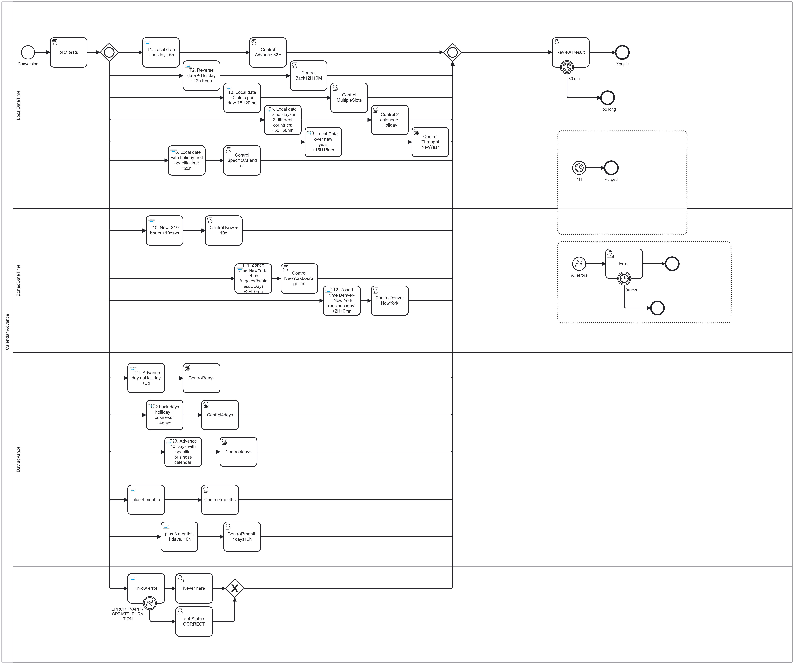

[](https://github.com/Camunda-Community-Hub/community/blob/main/extension-lifecycle.md#stable-)
[](https://github.com/camunda-community-hub/community)


# camunda-8-connector-calendaradvance


This connector calculates a new date from an existing one, advancing or moving it backward by a given delay.

It takes into account:
* Business days
* Open hours (e.g. office hours 9:00–18:00)
* Public holidays by country

Two modes are available: **days** and **hours**.

## Business Day
The default business day calendar runs Monday to Friday, 9:00–18:00. A custom calendar can be provided via the `businessCalendar` parameter.

See the [Business Calendar](#hours) section for details.

## Holidays
Public holidays are fetched from `https://date.nager.at/api/v3/PublicHolidays/`. Multiple countries can be combined to cumulate holidays. Specific holidays can also be defined directly in the `businessCalendar` field.

See the [Holidays](#holidays) section for details.

## Installation
See [How to install this connector](#how-to-install-this-connector) for installation instructions.

---

# Days

**Example:** Starting Thursday, January 15, 2026, advance by 3 business days in the USA.

With a Monday–Friday business calendar:
* Friday, January 16 counts as day 1
* Saturday and Sunday are skipped
* Monday, January 19 is a holiday (Martin Luther King Jr. Day)
* Tuesday, January 20 counts as day 2
* Wednesday, January 21 counts as day 3

**Result: Wednesday, January 21**

Moving backward from Wednesday, January 21 by 3 business days returns to Thursday, January 15, 2026.

---
# Months and years

Parameter `CalendarAdvance function` equals `Advance days`.

## Business day

In business day mode, the business calendar and holidays (optional) drive the progression. The duration must be expressed as an explicit number of days — durations in months or years are rejected, since "two months" cannot be converted to a deterministic number of business days.

## Calendar day

In calendar day mode, the connector advances by a fixed number of calendar days. For example, `P10D` from January 7 lands on January 17. Durations in months or years (e.g. `P1M`, `P1Y`) are supported.

To ensure the result falls on an open day, use the `targetProgression` parameter. When set to `after` or `before`, the business calendar and holidays (optional) are used to find the next available open day in the specified direction.


# Hours

Parameter `CalendarAdvance function` equals `Advance hours`.

The hours mode works the same way as days, except the delay is expressed in minutes using ISO 8601 duration format: `P(n)Y(n)M(n)DT(n)H(n)M(n)S`.

For example, to advance by 1 day, 14 hours and 15 minutes, use `Duration` equals `P1DT14H15M`.

The start date must include a time component, for example:
```json
{
  "startDate": "2026-01-15T11:50:00"
}
```

The business calendar must define time slots per day. Example for the `businessCalendar` field:
```json
[
    "Monday=08:00:00-12:00:00,14:00:00-18:00:00",
    "Tuesday=08:00:00-12:00:00,14:00:00-18:00:00",
    "Wednesday=08:00:00-12:00:00,14:00:00-18:00:00",
    "Thursday=08:00:00-17:00:00",
    "Friday=08:00:00-12:00:00,14:00:00-17:30:00",
    "Day_2026/07/14=08:00:00-12:00:00"
]
```

With this definition:
* Monday, Tuesday, Wednesday have two slots: 08:00–12:00 and 14:00–18:00
* Thursday is open non-stop from 08:00 to 17:00
* Friday has two slots, with an earlier afternoon end at 17:30
* Saturday and Sunday are not defined — they are treated as closed
* July 14, 2026 has a special definition (morning only), overriding the default Tuesday schedule

The duration is consumed across slots sequentially. For example, a 10-hour duration starting Monday at 08:00 uses the 08:00–12:00 slot (4h), then 14:00–18:00 (4h), then continues Tuesday from 08:00 to 10:00 for the remaining 2h.

## 24/7 calendar

To define a 24/7 calendar, use the special keyword `24/7` in the `businessCalendar` field:
```json
[
    "24/7"
]
```

## Holidays

Public holidays are fetched from `https://date.nager.at/api/v3/PublicHolidays/`. Multiple countries can be combined.

In the `Holidays Country` field, provide a single country:
```yaml
["FR"]
```

Or combine multiple countries:
```yaml
["FR", "US"]
```

To define specific closed or open days, use `Day_YYYY/MM/DD` entries in the `businessCalendar` field:
```yaml
[
  "Day_2026/07/14=08:00:00-12:00:00",
  "Day_2026/07/15=08:00:00-08:00"
]
```

* July 14 is open (morning only), even if it is a public holiday in the French calendar
* July 15 is closed (the time range is null)

## Timezone or no timezone?

First, some vocabulary:
* A `LocalDateTime` contains no timezone, e.g. `2026-01-16T15:34:00`
* A `ZonedDateTime` contains a timezone, e.g. `2026-01-16T15:34:00Z` (UTC) or `2026-01-16T09:15:00-05:00` (New York)
* The business calendar may or may not define a timezone

Two scenarios:
* **No timezone involved.** Starting at `09:15` with a 2-hour duration and a `09:00–18:00` calendar gives `11:15`.
* **Timezone involved.** Both the input date and the business calendar must reference a timezone. The connector converts the input to the business calendar timezone, performs the calculation, then returns both a local and a zoned result.

**Time zone in input, business calendar time zone**

Input: `2026-01-16T09:15:00-05:00` (New York). Business calendar timezone: California, slot `09:00–18:00`. Duration: 2 hours.

* Convert `09:15 New York` → `06:15 California`
* Next open slot starts at `09:00 California`; add 2 hours → `11:00 California`
* `resultDate` (LocalDateTime) = `11:00` (implicitly in the business calendar timezone)
* `zonedDate` (ZonedDateTime) = `14:00 New York`

The connector always returns two values:
* `resultDate` — a `LocalDateTime` in the business calendar timezone, or machine timezone if none is defined
* `zonedDate` — a `ZonedDateTime` in the input timezone, business calendar timezone, or machine timezone

**Detail of algorithm**

> The input date is first converted to a LocalDateTime in the business calendar timezone.

Starting from Tuesday at 11:50, with duration `P1DT14H15M` = 2295 minutes:

| Slot                          | Duration                  | Remaining             |
|-------------------------------|---------------------------|-----------------------|
| `Thursday=08:00:00-17:00:00`  | 5:10 = 300 mn             | 2295 − 300 = 1995 mn  |
| `Friday=08:00:00-12:00:00`    | 4:00 = 240 mn             | 1995 − 240 = 1755 mn  |
| `Friday=14:00:00-17:30:00`    | 3:30 = 210 mn             | 1755 − 210 = 1545 mn  |
| Saturday, Sunday — closed     |                           |                       |
| Monday January 19 — holiday   |                           |                       |
| `Tuesday=08:00:00-12:00:00`   | 4:00 = 240 mn             | 1545 − 240 = 1305 mn  |
| `Tuesday=14:00:00-18:00:00`   | 4:00 = 240 mn             | 1305 − 240 = 1065 mn  |
| `Wednesday=08:00:00-12:00:00` | 4:00 = 240 mn             | 1065 − 240 = 825 mn   |
| `Wednesday=14:00:00-18:00:00` | 4:00 = 240 mn             | 825 − 240 = 585 mn    |
| `Thursday=08:00:00-17:00:00`  | 9:00 = 540 mn             | 585 − 540 = 45 mn     |
| `Friday=08:00:00-12:00:00`    | 45 mn after 08:00 → 08:45 | 0                     |

`resultDate` = Friday, January 23 at 08:45. `zonedDate` is set if the input contains a timezone and a business calendar timezone is defined.

---

# Use cases

Different uses case can be retrieved in the [AdvanceCalendar.bpmn](src/test/resources/AdvanceCalendar.bpmn) example.




## T1. Local date + holiday: +6h

Start date: `2026-01-16T15:34:00`
Duration: `PT6H` = 360 mn
Business calendar: default
Holidays: US

| Day          | Use                             | Remaining       |
|--------------|---------------------------------|-----------------|
| Friday 16    | 18:00 − 15:34 = 146 mn          | 360 − 146 = 214 |
| Saturday 17  | Closed                          |                 |
| Sunday 18    | Closed                          |                 |
| Monday 19    | Closed (Martin Luther King Jr.) |                 |
| Tuesday 20   | 09:00 + 214 mn = 12:34          | 0               |

**Result: Tuesday, January 20, 12:34**

## T2. Reverse date + holiday: −12h10mn

Start date: `2026-07-15T10:34:00`
Duration: `PT12H10M` = 730 mn
Business calendar: default
Holidays: FR

| Day           | Use                    | Remaining       |
|---------------|------------------------|-----------------|
| Wednesday 15  | 10:34 − 09:00 = 94 mn  | 730 − 94 = 636  |
| Tuesday 14    | Closed (Bastille Day)  |                 |
| Monday 13     | 18:00 − 09:00 = 540 mn | 636 − 540 = 96  |
| Sunday 12     | Closed                 |                 |
| Saturday 11   | Closed                 |                 |
| Friday 10     | 18:00 − 96 mn = 16:24  | 0               |

**Result: Friday July 10, 16:24**

## T3. Local date, 2 slots/day: +18h20mn

Start date: `2026-03-26T11:50:00`
Duration: `PT18H20M` = 1100 mn
Business calendar:
```json
[
  "Monday=09:00:00-12:00:00,14:10:00-18:00:00",
  "Tuesday=09:00:00-12:00:00,14:10:00-18:00:00",
  "Wednesday=09:00:00-12:00:00,14:10:00-18:00:00",
  "Thursday=09:00:00-12:00:00,14:10:00-18:00:00",
  "Friday=09:00:00-12:00:00"
]
```
Holidays: US

| Day          | Use                                     | Remaining        |
|--------------|-----------------------------------------|------------------|
| Thursday 26  | 11:50–12:00 + 14:10–18:00 = 10 + 230 mn | 1100 − 240 = 860 |
| Friday 27    | 09:00–12:00 = 180 mn                    | 860 − 180 = 680  |
| Saturday 28  | Closed                                  |                  |
| Sunday 29    | Closed                                  |                  |
| Monday 30    | 09:00–12:00 = 180 mn                    | 680 − 180 = 500  |
|              | 14:10–18:00 = 230 mn                    | 500 − 230 = 270  |
| Tuesday 31   | 09:00–12:00 = 180 mn                    | 270 − 180 = 90   |
|              | 14:10 + 90 mn = 15:40                   | 0                |

**Result: Tuesday March 31, 15:40**

## T4. Local date, 2 holidays in 2 countries: +60h50mn

Start date: `2026-07-02T17:15:00`
Duration: `PT60H50M` = 3650 mn
Business calendar: default
Holidays: US, FR

| Day          | Use                                | Remaining         |
|--------------|------------------------------------|-------------------|
| Thursday 2   | 17:15–18:00 = 45 mn                | 3650 − 45 = 3605  |
| Friday 3     | Closed (Independence Day observed) |                   |
| Saturday 4   | Closed                             |                   |
| Sunday 5     | Closed                             |                   |
| Monday 6     | 09:00–18:00 = 540 mn               | 3605 − 540 = 3065 |
| Tuesday 7    | 09:00–18:00 = 540 mn               | 3065 − 540 = 2525 |
| Wednesday 8  | 09:00–18:00 = 540 mn               | 2525 − 540 = 1985 |
| Thursday 9   | 09:00–18:00 = 540 mn               | 1985 − 540 = 1445 |
| Friday 10    | 09:00–18:00 = 540 mn               | 1445 − 540 = 905  |
| Saturday 11  | Closed                             |                   |
| Sunday 12    | Closed                             |                   |
| Monday 13    | 09:00–18:00 = 540 mn               | 905 − 540 = 365   |
| Tuesday 14   | Closed (Bastille Day)              |                   |
| Wednesday 15 | 09:00 + 365 mn = 15:05             | 0                 |

**Result: Wednesday July 15, 15:05**

## T5. Local date over new year: +15h15mn

Start date: `2026-12-30T13:54`
Duration: `PT15H15M` = 915 mn
Business calendar: default
Holidays: US

| Day           | Use                     | Remaining        |
|---------------|-------------------------|------------------|
| Wednesday 30  | 13:54–18:00 = 246 mn    | 915 − 246 = 669  |
| Thursday 31   | 09:00–18:00 = 540 mn    | 669 − 540 = 129  |
| Friday Jan 1  | Closed (New Year's Day) |                  |
| Saturday 2    | Closed                  |                  |
| Sunday 3      | Closed                  |                  |
| Monday 4      | 09:00 + 120 mn = 11:00  | 0                |

**Result: Monday January 4, 11:00**

## T6. Local date with holiday and specific times: +20h

Start date: `2026-05-13T15:18`
Duration: `PT20H` = 1200 mn
Business calendar:
```json
[
  "Monday=09:00:00-18:00:00",
  "Tuesday=09:00:00-18:00:00",
  "Wednesday=09:00:00-18:00:00",
  "Thursday=09:00:00-18:00:00",
  "Friday=09:00:00-18:00:00",
  "Day_2026/05/14=09:00-11:40",
  "Day_2026/05/15=09:00-11:50"
]
```
Holidays: FR

May 14 is Ascension Day (public holiday in France), but explicitly open via the calendar override. May 15 has a specific morning-only schedule.

| Day               | Use                    | Remaining          |
|-------------------|------------------------|--------------------|
| Wednesday May 13  | 15:18–18:00 = 162 mn   | 1200 − 162 = 1038  |
| Thursday May 14   | 09:00–11:40 = 160 mn   | 1038 − 160 = 878   |
| Friday May 15     | 09:00–11:50 = 170 mn   | 878 − 170 = 708    |
| Monday May 18     | 09:00–18:00 = 540 mn   | 708 − 540 = 168    |
| Tuesday May 19    | 09:00 + 168 mn = 11:48 | 0                  |

**Result: Tuesday May 19, 11:48**

## T10. 24/7 calendar: +10 days

Start date: `2026-09-11T13:54`
Duration: `P10D` = 14400 mn
Business calendar: 24/7
Holidays: US

| Day          | Use                    | Remaining             |
|--------------|------------------------|-----------------------|
| Friday 11    | 13:54–00:00 = 606 mn   | 14400 − 606 = 13794   |
| Saturday 12  | 00:00–00:00 = 1440 mn  | 13794 − 1440 = 12354  |
| Sunday 13    | 00:00–00:00 = 1440 mn  | 12354 − 1440 = 10914  |
| Monday 14    | 00:00–00:00 = 1440 mn  | 10914 − 1440 = 9474   |
| Tuesday 15   | 00:00–00:00 = 1440 mn  | 9474 − 1440 = 8034    |
| Wednesday 16 | 00:00–00:00 = 1440 mn  | 8034 − 1440 = 6594    |
| Thursday 17  | 00:00–00:00 = 1440 mn  | 6594 − 1440 = 5154    |
| Friday 18    | 00:00–00:00 = 1440 mn  | 5154 − 1440 = 3714    |
| Saturday 19  | 00:00–00:00 = 1440 mn  | 3714 − 1440 = 2274    |
| Sunday 20    | 00:00–00:00 = 1440 mn  | 2274 − 1440 = 834     |
| Monday 21    | 00:00 + 834 mn = 13:54 | 0                     |

**Result: Monday September 21, 13:54**

## T11. Zoned time New York → Los Angeles: +2h10mn

Start: `2026-03-30T09:14:00-04:00[America/New_York]`
Calendar: 09:00–18:00 Pacific Time
Duration: 2h10 = 130 mn

Convert: 09:14 New York → 06:14 Los Angeles

| Day                | Use                     | Remaining |
|--------------------|-------------------------|-----------|
| Monday 2026-03-30  | 09:00 + 130 mn = 11:10  | 0         |

**Result:**
* `resultDate` (Local): `11:10`
* `zonedDate` (New York): `2026-03-30T14:10:00-04:00`

## T12. Zoned time Denver → New York: +2h10mn

Start: `2026-03-30T15:20:00-06:00[America/Denver]`
Calendar: 09:00–18:00 New York Time
Duration: 2h10 = 130 mn

Convert: 15:20 Denver → 17:20 New York

| Day                | Use                   | Remaining      |
|--------------------|-----------------------|----------------|
| Monday 2026-03-30  | 17:20–18:00 = 40 mn   | 130 − 40 = 90  |
| Tuesday 2026-03-31 | 09:00 + 90 mn = 10:30 | 0              |

**Result:**
* `resultDate` (Local): `10:30`
* `zonedDate` (Denver): `2026-03-31T08:30:00-06:00`

## T21. Calendar days, no holidays: +3d

Start date: `2026-07-10` (Friday)
Duration: `P3D`
No business calendar · Holidays enabled

| Day                  | Remaining   |
|----------------------|-------------|
| Saturday 2026-07-11  | 3 − 1 = 2d  |
| Sunday 2026-07-12    | 2 − 1 = 1d  |
| Monday 2026-07-13    | 1 − 1 = 0d  |

**Result: 2026-07-13T00:00:00**

## T22. Calendar days backward, no holidays: −4d

Start date: `2026-07-15` (Wednesday)
Duration: `P4D` (reverse)
No business calendar · Holidays: FR

| Day                                 | Remaining   |
|-------------------------------------|-------------|
| Thursday 14 (Bastille Day — closed) |             |
| Monday 2026-07-13                   | 4 − 1 = 3d  |
| Sunday 12 (closed)                  |             |
| Saturday 11 (closed)                |             |
| Friday 2026-07-10                   | 3 − 1 = 2d  |
| Thursday 2026-07-09                 | 2 − 1 = 1d  |
| Wednesday 2026-07-08                | 1 − 1 = 0d  |

**Result: 2026-07-08T00:00:00**

## T23. Business days with specific calendar: +10d

Start date: `2026-07-02`
Duration: `P10D`

July 3 is open; July 4 is closed (Independence Day substitute). July 14 is open with specific hours.

```json
[
  "Monday=09:00:00-18:00:00",
  "Tuesday=09:00:00-18:00:00",
  "Wednesday=09:00:00-18:00:00",
  "Thursday=09:00:00-18:00:00",
  "Friday=09:00:00-18:00:00",
  "Day_2026/07/14=09:00-11:40",
  "Day_2026/05/15=09:00-11:50"
]
```

| Day                         | Remaining  |
|-----------------------------|------------|
| Thursday 03                 | 10 − 1 = 9 |
| Friday 04 (closed)          |            |
| Saturday 05 (closed)        |            |
| Sunday 06 (closed)          |            |
| Monday 2026-07-07           | 9 − 1 = 8  |
| Tuesday 2026-07-08          | 8 − 1 = 7  |
| Wednesday 2026-07-09        | 7 − 1 = 6  |
| Thursday 2026-07-10         | 6 − 1 = 5  |
| Friday 2026-07-11           | 5 − 1 = 4  |
| Saturday 12 (closed)        |            |
| Sunday 13 (closed)          |            |
| Monday 14 (open — specific) | 4 − 1 = 3  |
| Tuesday 2026-07-15          | 3 − 1 = 2  |
| Wednesday 2026-07-16        | 2 − 1 = 1  |
| Thursday 2026-07-17         | 1 − 1 = 0  |

**Result: 2026-07-17T00:00:00**

# T24. Business days, month-based: +4M

Start date: `2026-07-14`
Duration: `P4M`
Direction: advance · Target: before

| Day                           | Remaining    |
|-------------------------------|--------------|
| Saturday 2026-11-14 (closed)  | 4m − 4m = 0  |
| Friday 2026-11-13             |              |

**Result: 2026-11-13T00:00:00**

---

# How to install this connector?

## Element template

Go to the `element-templates` folder, or download directly:
[calendaradvance-function.json](element-templates/calendaradvance-function.json)

## JAR file

JAR files are available under the **Releases** section. Three deployment options are available.

### Via the connector runtime

Configure the connector runtime to download the JAR at initialization:

```yaml
connectors:
  initContainers:
    - name: calendaradvance
      image: appropriate/curl
      securityContext:
        runAsUser: 1000
        runAsNonRoot: true
      args:
        - "-L"
        - "-o"
        - "/opt/custom/calendar-advance-function-1.0.0.jar"
        - "https://github.com/camunda-community-hub/camunda-8-connector-calendaradvance/releases/download/1.0.0/calendar-advance-function-1.0.0.jar"
      volumeMounts:
        - name: custom-connectors
          mountPath: /opt/custom
  extraVolumes:
    - name: custom-connectors
      emptyDir: {}
  extraVolumeMounts:
    - name: custom-connectors
      mountPath: /opt/custom/calendar-advance-function-1.0.0.jar
      subPath: calendar-advance-function-1.0.0.jar
```

See [ConnectorRuntime.md](https://github.com/camunda-community-hub/challenges/blob/main/c8-connector-deployment-challenge/solution/ConnectorRuntime.md) for details.

### Via a custom image

Clone the repository and build your own image using the `k8s` folder: [README.md](k8s/README.md)

### Via any application

Include the JAR file directly in your own application.