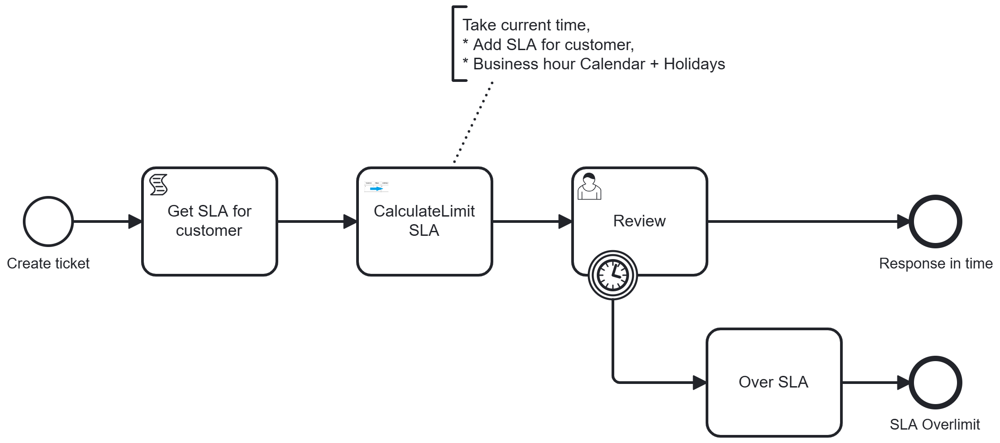

[](https://github.com/Camunda-Community-Hub/community/blob/main/extension-lifecycle.md#stable-)
[](https://github.com/camunda-community-hub/community)


# camunda-8-connector-calendaradvance



The connector calculate a new date from an existing one, and advance (or backward) by a delay. 

It takes into account:
* Business days
* Open time (for example, office is open 9:00 to 18:00)
* Holidays according country

The connector has to mode
* days
* hours

# Days

We are the Thursday, January 15, 2026. We want to advance by 3 business days, in the USA territory.

When Business Day is Monday to Friday, advance 3 days means
* Friday, January 16 count as 1.
* Saturday, and Sunday are skip
* Monday, January 19 is a holiday (Martin Luther King Jr day)
* Tuesday, January 20 count as 1
* Wednesday, January 21 count as 1

The result is Wednesday, January 21

As opposite, starting from Wednesday, January 21 and moving backward, result will be on Thursday, January 15, 2026

# Hours
The hour mechanism works as the same, except the delay is given in minutes, using ISO‑8601. Format is P(n)Y(n)M(n)DT(n)H(n)M(n)S)

For example, to advance for 1 day, 14 hours, 15 minutes, the duration is `P1DT14H15M`.
The reference is a date, in seconds. For example
```json
{
  "startDate": "2026-01-15T11:50:00"
}
```

The business day must be more precise, and give in the day the different slot. For example
```json

{
  "businessCalendar" : [
    "Monday=08:00:00-12:00:00,14:00:00-18:00:00",
    "Tuesday=08:00:00-12:00:00,14:00:00-18:00:00",
    "Wednesday=08:00:00-12:00:00,14:00:00-18:00:00",
    "Thursday=08:00:00-17:00:00",
    "Friday=08:00:00-12:00:00,14:00:00-17:30:00",
    "Day_2026/07/14=08:00:00-12:00:00"
    ]
}
```

Via this definition:
* For each Monday, Tuesday, Wednesday, two slots are available, 08:00 to 12:00, and 14:00 (2pm) to 18:00 (6pm)
* Thursday has a different section, `08:00` to `17:00` non-stop
* Wednesday has two slots, but the afternoon end sooner
* Saturday and Sunday are not defined, they are considered as close day
* 14 july 2026 has a special definition, only the morning is open. It will override the default Tuesday definition.

The calculation will apply the delay on this calendar.


## Timezone or no timezone?

First, some vocabulary:
* a LocalDateTime does not contain any time zone. It is something like `2026-01-16T15:34:00`
* a ZonedDateTime contains a time zone. it is something like `2026-01-16T15:34:00Z` (UTC) or `2026-01-16T09:15:00-05:00` (New York)
* the Business Calendar may be defined in a timezone, or not

THere is two different situation
* No time zone are involved. From a Start date at `09:15`, and a duration of 2 hours, a business calendar `09:00-18:00`, the result should be `11:15`
* Time zone is involved in the input AND in the business Calendar. When the business Calendar is provided for California : `09:00-18:00`. The result is now `11:00` California time, i.e. `14:00` New York.

**Time Zone in Input, Business Calendar Time Zone**
To enable the time zone calculation, both inout and business calendar must reference a time zone.

Let's decompose the Time zone calculation:
Input is a ZonedDateTime like `2026-01-16T09:15:00-05:00`. This is `09:15` **New York time zone**, 
Business Calendar time zone is **California time zone**, with a period `09:00-18:00` 

A 2 hours duration Advance means the result is 
* First translate the `09:15` **New York**  in **California** time, is.e. `06:15`
* Then, calcul search for the next business period, at `09:00` and add 2 hours. The result is `11:00` **California time zone**
* Result is resultDate (a LocalDateTime) `11:00` (implicit, in the Business Calendar Timezone) and zonedDate (a ZonedDateTime) `14:00`  


Note: at the end, the connector provide two dates
* a LocalDateTime, without any timezone. Actually, this date is in the Business Calendar Timezone or in the machine timezone
* a ZonedDateTime. This date is provided in the input time zone, or in the Business Calendar TimeZone or in the machine time zone.

** Detail of algorithm**

> According to the time zone discussion, first the date is transform to a LocalDateTime in the Business Calendar Time Zone**

Starting from that, calculation will use slots until arriving to consume the delay of 1 day, 14 hours, 15 minutes and 10 seconds, which is 
```
duration = 1*24*60+14*60+15 = 2295 mn
``` 

Starting on Tuesday at 11:50, the fist slot is `Thursday=08:00:00-17:00:00`. The available time is 17:00:00 - 11:50 = 5:10 mn. The total duration is 
Calculation is

| Slot                            | duration       | Relicat                            |
|---------------------------------|----------------|------------------------------------| 
| `Thursday=08:00:00-17:00:00`    | 5:10 = 300 mn  | 2295-300= 1995 mn                  |
| `Friday=08:00:00-12:00:00`      | 4:00 = 240 mn  | 1995-240= 1755 mn                  | 
| `Friday=14:00:00-17:30:00`      | 3:30 = 210 mn  | 1755 - 210 = 1545                  |       
| Saturday, Sunday are close      |                |                                    |
| Monday, January 19 is a holiday |                |                                    |
| `Tuesday=08:00:00-12:00:00`     | 4:00 = 240 mn  | 1545-240= 1305 mn                  |
| `Tuesday=14:00:00-18:00:00`     | 4:00 = 240 mn  | 1385-240= 1065 mn                  |
| `Wednesday=08:00:00-12:00:00`   | 4:00 = 240 mn  | 1065-240= 825 mn                   |
| `Wednesday=14:00:00-18:00:00`   | 4:00 = 240 mn  | 1385-240= 585 mn                   |
| `Thursday=08:00:00-17:00:00`    | 9:00 = 540 mn  | 585-540= 45 mn                     |
| `Friday=08:00:00-12:00:00`      | 4:00 = 240 mn  | 45 after 08:00 result is 08:45 mn  | 

resultDate will be on Friday, January 23 at 08:45 mn
zonedDate is set if the input contains a TimeZone, and a business time zone is define,


# Use case

Different use case are exposed, to explain in detail how the connector works.


## T1. Local date + holiday : 6h

Start date:  2026-01-16 at 15:34:00
Duration: PT6H = 360 mn
Business calendar : default
Use Holiday true / US

| Day                 | Use                            | Relicat                      | 
|---------------------|--------------------------------|------------------------------| 
| Friday 16           | 18:00-15:34= 2:26 mn = 146 mn  | 360-146 = 214                | 
| Saturday 17         | Close                          |                              |
| Sunday 18           | Close                          |                              | 
| Monday 19           | Close (Martin Luther Kind)     |                              | 
| Tuesday 20          | 18:00-09h = 9:00= 540 mn       | 540 > 214 : 9:00+214= 12:34  |

Result: Tuesday 20, 12:34

## T2. Reverse date + Holiday : 12h10mn

Start date:  2026-07-15T10:34:00
Duration: PT12H10M = 730 mn
Business calendar : default
Use Holiday true / FR

| Day           | Use                       | Relicat                         | 
|---------------|---------------------------|---------------------------------| 
| Wednesday 15  | 10:34-09:00= 94 mn        | 730-94 = 636                    | 
| Tuesday 14 17 | Close (bastille day)      |                                 |
| Monday 13     | 18:00-09h = 9:00= 540 mn  | 636-540= 96                     | 
| Sunday 12     | Close                     |                                 | 
| Saturday 11   | Close                     |                                 | 
| Friday 10     | 18:00-09:00 = 9h = 540 mn | 540 > 96 : 18:00 - 96 mn=16:24  |     

Result: Friday 10, 16:24


## T3. Local date - 2 slots per day: 18H20mn


Start date:  2026-03-26T11:50:00
Duration: PT18H20M = 1100 mn
Business calendar :
"Monday=09:00:00-12:00:00,14:10:00-18:00:00",
"Tuesday=09:00:00-12:00:00,14:10:00-18:00:00",
"Wednesday=09:00:00-12:00:00,14:10:00-18:00:00"
"Thursday=09:00:00-12:00:00,14:10:00-18:00:00",
"Friday=09:00:00-12:00:00"

Use Holiday true / US

| Day         | Use                                              | Relicat                        | 
|-------------|--------------------------------------------------|--------------------------------| 
| Thursday 26 | 11:50:00-12:00:00 + 14:10:00-18:00:00= 10+230 mn | 1100-240 = 860                 | 
| Friday 27   | 09:00:00-12:00:00 : 180 mn                       | 860-180 = 680                  |  
| Saturday 29 | Close                                            |                                | 
| Sunday 30   | Close                                            |                                | 
| Monday 30   | 09:00:00-12:00:00 = 180 mn                       | 680-180= 500                   |
|             | 14:10:00-18:00:00 = 230 mn                       | 500-230= 270                   |
| Tuesday 31  | 09:00:00-12:00:00 : 180 mn                       | 270-180= 90                    |
|             | 14:10:00-18:00:00 = 230 mn                       | 230 > 90 : 09:00 +90 mn= 15:40 |


Result: Tuesday 31, 10:30


## T4. Local date - 2 holidays in 2 different countries: +60H50mn

Start date:  2026-07-02T17:15:00
Duration: PT60H50M = 3650 mn
Business calendar : no
Use Holiday true / US,FR

| Day          | Use                         | Relicat                          | 
|--------------|-----------------------------|----------------------------------|
| Thursday 2   | 17:15:00-18:00:00= 45 mn    | 3650-45= 3605 mn                 |                   
| Friday 3     | Close (Indep. day observed) |                                  |
| Saturday 4   | Close                       |                                  |
| Sunday 5     | Close                       |                                  |
| Monday 6     | 09:00-18:00 (540 mn)        | 3685-540 = 3065 mn               |                  
| Tuesday 7    | 09:00-18:00 (540 mn)        | 3065-540= 2525 mn                |                
| Wednesday 8  | 09:00-18:00 (540 mn)        | 2525-540 = 1985 mn               |                  
| Thursday 9   | 09:00-18:00 (540 mn)        | 1985-540= 1445 mn                |                    
| Friday 10    | 09:00-18:00 (540 mn)        | 1445-540= 905 mn                 |                      
| Saturday 11  | Close                       |                                  |
| Sunday 12    | Close                       |                                  |
| Monday 13    | 09:00-18:00 (540 mn)        | 905-540=365 mn                   |                  
| Tuesday 14   | Close (bastille day)        |                                  |     
| Wednesday 15 | 09:00-18:00 (540 mn)        | 540 > 365 : 09:00 +365 mn= 15:05 |  


Result: Wednesday 15, 15:05


## T5. Local Date over new year: +15H15mn

Start date:  2026-12-30T13:54
Duration: PT15H15M = 915 mn
Business calendar : no
Use Holiday true / US

| Day           | Use                    | Relicat          | 
|---------------|------------------------|------------------|
| Wednesday 30  | 13:54-18:00:00= 246 mn | 915-246= 669 mn  |  
| Thursday 31   | 09:00-18:00 (540 mn)   | 669-540 = 120 mn | 
| Friday 1      | Close                  |                  |
| Saturday 2    | Close                  |                  |
| Sunday 3      | Close                  |                  |
| Monday 4      | 09:00-11:09 (129 mn)   | 0                | 

Result Monday 4, 11:09

## T6. Local date with holiday and specific time +20h

May 14 (ascension day) and May 15 special time, only morning

Start date:  2026-05-13T15:18
Duration: PT20H = 1200 mn
Business calendar :
```json
[ "Monday=09:00:00-18:00:00",
  "Tuesday=09:00:00-18:00:00",
  "Wednesday=09:00:00-18:00:00",
  "Thursday=09:00:00-18:00:00",
  "Friday=09:00:00-18:00:00",
  "Day_2026/05/14=09:00-11:40", // Ascension day : it's a holiday in France, but we are open
  "Day_2026/05/15=09:00-11:50"]; // Day after Ascension"
```


Use Holiday true / FR


| Day                    | Use                   | Relicat           |
|------------------------|-----------------------|-------------------|
| WEDNESDAY (2026-05-13) | 15:18-18:00 (162 mn)  | 1200 - 162 = 1038 |
| THURSDAY (2026-05-14)  | 09:00-11:40 (160 mn)  | 1038 - 160 = 878  |
| FRIDAY (2026-05-15)    | 09:00-11:50 (170 mn)  | 878 - 170 = 708   |
| MONDAY (2026-05-18)    | 09:00-17:18 (540 mn)  | 708 - 540 = 168   |
| TUESDAY (2026-05-19)   | 09:00-11:48 (168 mn)  |                   | 

Result is 2026-05-19T11:48


## T10. Now. 24/7 hours +10days


Start date:  2026-09-11T13:54
Duration: P10D = 14400 mn
Business calendar : 24/7
Use Holiday true / US

| Day          | Use                    | Relicat              | 
|--------------|------------------------|----------------------|
| FRIDAY 11    | 13:54-00:00 (606 mn)   | 14400 - 606 = 13794  | 
| SATURDAY 12  | 00:00-00:00 (1440 mn)  | 13794 - 1440 = 12354 |
| SUNDAY 13    | 00:00-00:00 (1440 mn)  | 12354 - 1440= 10914  |      
| MONDAY 14    | 00:00-00:00 (1440 mn)  | 10914 - 1440= 9474   |      
| TUESDAY 15   | 00:00-00:00 (1440 mn)  | 9474 - 1440= 8034    |         
| WEDNESDAY 16 | 00:00-00:00 (1440 mn)  | 8034 - 1440= 6594    |
| THURSDAY 17  | 00:00-00:00 (1440 mn)  | 6594 - 1440=5154     |          
| FRIDAY 18    | 00:00-00:00 (1440 mn)  | 5154 - 1440= 3714    |        
| SATURDAY 19  | 00:00-00:00 (1440 mn)  | 3714 - 1440= 2274    |          
| SUNDAY 20    | 00:00-00:00 (1440 mn)  | 2274 - 1440= 834     |           
| MONDAY 21    | 00:00-13:54 (834 mn)   |                      |


Result : 2026-09-21T13:54


## T11. Zoned time NewYork->Los Angeles(businessDDay) +2H10mn

2026-03-30T09:14:00-04:00[America/New_York] 
Calendar 09:00-18:00 PACIFIC TIME

Advance 2:10 hours = 130 mn

09:14 America/New_York => 06:15 America/Los Angeles

| Day                  | Use                  | Relicat |
|----------------------|----------------------|---------|
| MONDAY (2026-03-30)  | 09:00-18:00 (130 mn) |         |

Result is 
Local Time: 11:10
ZonedDateTime (New_York) : 2026-03-30T14:10:00-04:00 


## T12. Zoned time Denver->New York (businessday) +2H10mn

2026-03-30T15:20:00-06:00[America/Denver] 

Calendar 09:00-18:00 NEW YORK TIME

Advance 2:10 hours = 130 mn

15:20 America/Denver => 17:20 America/New_York

| Day                  | Use                 | Relicat       |
|----------------------|---------------------|---------------|
| MONDAY (2026-03-30)  | 17:20-18:00 (40 mn) | 130 - 40 = 90 |
| TUESDAY (2026-03-31) | 09:00-10:30 (90 mn) |               |


Result is
Local Time: 10:30
ZonedDateTime (Denver) :2026-03-31T08:30:00-06:00 


## T21. Advance CalendarDay noHolliday +3d

Start date:  2026-07-10 (Friday)
Duration: P3D
No Business calendar
Use holidays

| Day                   | Relicat |
|-----------------------|---------|
| SATURDAY (2026-07-11) | 3-1=2d  |
| SUNDAY (2026-07-12)   | 2-1=1d  |
| MONDAY (2026-07-13)   | 1-1=0d  |

Result: 2026-07-13T00:00:00


## T22. Reverse CalendarDay we+noHoliday -4d

Start date:  2026-07-15 (Wednesday)
Duration: P4D
No Business calendar
Use holidays

| Day                     | Relicat |
|-------------------------|---------|
| THURSDAY 14 (close)     |         |
| MONDAY (2026-07-13)     | 4-1=3d  |
| SUNDAY 12 (close)       |         |
| SATURDAY 11 (close)     |         |
| FRIDAY (2026-07-10)     | 3-1=2d  |
| THURSDAY (2026-07-09)   | 2-1=1d  |
| WEDNESDAY (2026-07-08)  | 1-1=0d  |

Result: 2026-07-08T00:00:00


## T23. Advance 10 Days with specific business calendar

Start: 2025-07-02
Duration: P10D

July 3 is close (substitute july 4)

One day is close, 
one day is open with specific time schedule

```json

[ "Monday=09:00:00-18:00:00",
"Tuesday=09:00:00-18:00:00",
"Wednesday=09:00:00-18:00:00",
"Thursday=09:00:00-18:00:00",
"Friday=09:00:00-18:00:00",
"Day_2026/07/14=09:00-11:40", // July 14 day : it's a holiday in France, but we are open
"Day_2026/05/15=09:00-11:50"];
```


| Day                       | Relicat |
|---------------------------|---------|
| THRUSDAY 03               | 10-1=9  |
| FRIDAY 04 (close)         |         |
| SATURDAY 05 (close)       |         |
| SUNDAY 06 (close)         |         |
| MONDAY 2026-07-07         | 9-1=8   |
| TUESDAY 2026-07-08        | 8-1=7   |
| WEDNESDAY 2026-07-09      | 7-1=6   |
| THRUSDAY 2026-07-10       | 6-1=5   |
| FRIDAY 2026-07-11         | 5-1=4   |
| SATURDAY 12 (close)       |         |
| SUNDAY 13 (close)         |         |
| MONDAY 14 (open-specific) | 4-1=3   |
| TUESDAY 2026-07-15        | 3-1=2   |
| WEDNESDAY 2026-07-16      | 2-1=1   |
| THRUSDAY 2026-07-17       | 1-1=0  |

Result: 2026-07-17T00:00:00


# T24. Business Day +4M

Start date:  2026-07-14
Duration: P4M
Advance days
Target progression: before

| Day                         | Relicat |
|-----------------------------|---------|
| SATURDAY 2026-11-14 (close) | 4m-4m=0 |
| FRIDAY 2026-11-13           |         |


Result: 2026-07-13T00:00:00
